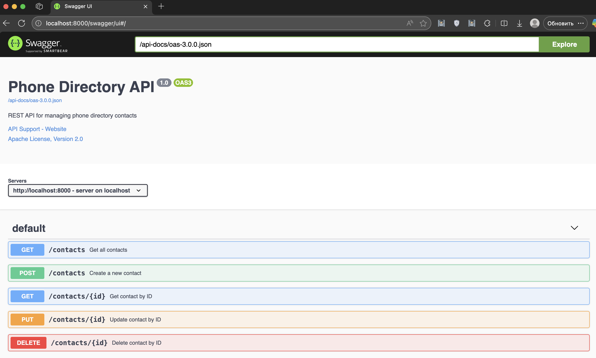

# Phone Directory API

REST API for managing phone directory contacts, developed using the Oat++ framework.

## Description

This project is a RESTful API for working with a phone directory. The API provides a complete set of CRUD operations for managing contacts, including creating, reading, updating, and deleting records. All endpoints are documented through Swagger UI.

## Technologies

- **Language**: C++20
- **Framework**: [Oat++](https://oatpp.io/) v1.3.0
- **Swagger**: [oatpp-swagger](https://github.com/oatpp/oatpp-swagger) v1.3.0
- **Build System**: CMake 3.14+
- **Code Style**: Google C++ Style Guide

## Project Structure

```
Task_For_NTEC/
├── CMakeLists.txt                    # CMake build configuration
├── src/
│   ├── main.cpp                      # Application entry point
│   ├── dto/
│   │   ├── ContactDto.hpp            # Contact data model (DTO)
│   │   └── ErrorDto.hpp              # Error response data model
│   ├── repository/
│   │   └── ContactRepository.hpp    # In-memory data storage layer
│   ├── service/
│   │   └── ContactService.hpp        # Business logic and validation
│   ├── controller/
│   │   └── ContactController.hpp     # HTTP request handlers (REST endpoints)
│   ├── exception/
│   │   └── ExceptionHandler.hpp      # Centralized error handling
│   ├── appComponent/
│   │   └── ContactComponent.hpp      # Dependency injection container
│   └── swagger/
│       └── SwaggerComponent.hpp      # Swagger UI configuration
└── tests/
    ├── AllTestsMain.cpp              # Test runner entry point
    ├── ContactRepositoryTest.hpp     # Repository layer unit tests
    └── ContactServiceTest.hpp        # Service layer unit tests
```

### Components

- **DTO (Data Transfer Objects)**: Data models for JSON serialization/deserialization
- **Repository**: Data access layer with in-memory storage
- **Service**: Business logic and data validation
- **Controller**: HTTP handlers, request/response mapping
- **Exception Handler**: Centralized error handling
- **Component**: Dependency Injection container (Oat++ components)

## Building the Project

### Requirements

- **CMake** version 3.14 or higher
- **C++ compiler** with C++20 support 
- **Git** (for downloading dependencies)

### Build Instructions

```bash
# Clone repository
git clone <repository-url>
cd Task_For_NTEC

# Create build directory
mkdir build && cd build

# Configure and build (dependencies are downloaded automatically)
cmake ..
make

# Run server
./Task_For_NTEC
```

### Running Tests

After building, run:
```bash
./Task_For_NTEC_tests
```

## API Endpoints

### Base URL
```
http://localhost:8000
```

### Endpoints

| Method   | Path             | Description          |
|----------|------------------|----------------------|
| `POST`   | `/contacts`      | Create a new contact |
| `GET`    | `/contacts/{id}` | Get contact by ID    |
| `GET`    | `/contacts`      | Get all contacts     |
| `PUT`    | `/contacts/{id}` | Update contact       |
| `DELETE` | `/contacts/{id}` | Delete contact       |

### Data Model (ContactDto)

```json
{
  "id": 1,
  "name": "Ivan Ivanov",
  "phone": "+79991234567",
  "address": "Moscow, Lenin St., 1"
}
```

### Request Examples

**Create contact:**
```bash
curl -X POST http://localhost:8000/contacts \
  -H "Content-Type: application/json" \
  -d '{
    "name": "John Doe",
    "phone": "+79991234567",
    "address": "Moscow, Main St., 1"
  }'
```

**Get contact by ID:**
```bash
curl http://localhost:8000/contacts/1
```

**Get all contacts:**
```bash
curl http://localhost:8000/contacts
```

**Update contact:**
```bash
curl -X PUT http://localhost:8000/contacts/1 \
  -H "Content-Type: application/json" \
  -d '{
    "name": "John Updated",
    "phone": "+79997654321",
    "address": "Saint Petersburg, Nevsky Ave., 10"
  }'
```

**Delete contact:**
```bash
curl -X DELETE http://localhost:8000/contacts/1
```

## Swagger UI

After starting the server, Swagger UI is available at:

```
http://localhost:8000/swagger/ui
```

Swagger UI provides:
- Interactive documentation of all endpoints
- Data model descriptions
- Ability to test the API directly from the browser

### Swagger UI Screenshot

<!-- Insert Swagger UI screenshot here -->


## Testing

The project includes unit tests for main components:

- **ContactRepositoryTest**: 10 tests for CRUD operations in the repository
- **ContactServiceTest**: 14 tests for business logic and validation

All tests use the `oatpp-test` framework and output detailed execution information.

## Error Handling

The API uses centralized error handling through `ApiErrorHandler`. All errors are returned in `ErrorDto` format:

```json
{
  "status": 404,
  "message": "Not Found",
  "details": "Contact not found"
}
```

Possible HTTP status codes:
- `400 Bad Request` - invalid data or parameters
- `404 Not Found` - contact not found
- `500 Internal Server Error` - internal server error

## Data Storage

The project uses **in-memory storage** based on `std::unordered_map`. Data is stored only during application runtime and is lost on restart.

On first startup, 3 test contacts are automatically created:
- ID: 1, Name: "Ivan Ivanov"
- ID: 2, Name: "Maria Petrova"
- ID: 3, Name: "Alexey Sidorov"

## Implementation Features

- **Thread-safety**: Repository is protected by mutex for safe operation in multi-threaded environment
- **Auto ID generation**: When creating a contact without specifying ID, ID is generated automatically
- **Data validation**: All data is validated at the Service layer before saving
- **Dependency Injection**: Uses built-in DI system from Oat++
- **RAII**: Follows RAII principles for resource management